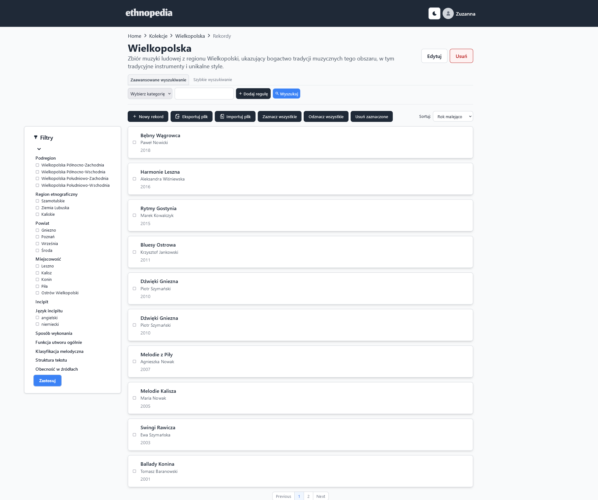
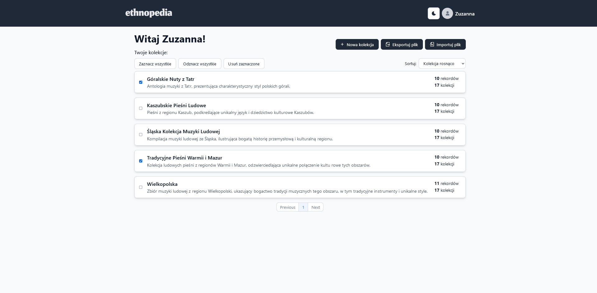
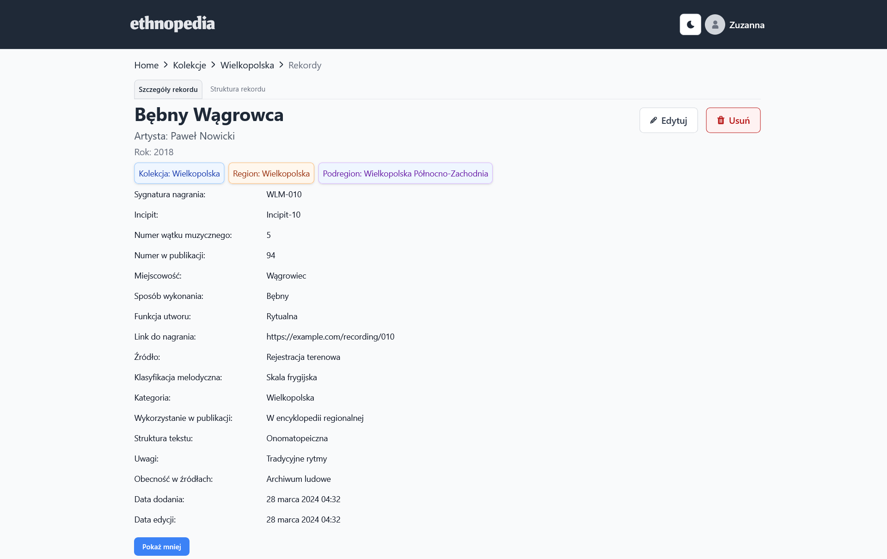
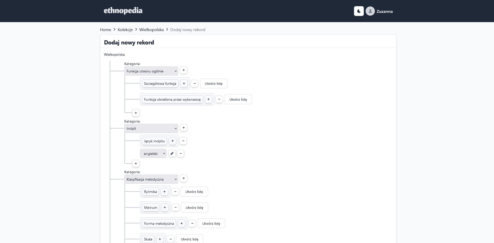
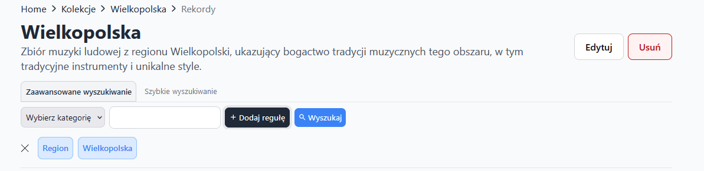

# Ethnopedia

Ethnopedia is a desktop and web application inspired by CollectiveAccess that allows users to edit the metadata of their files in a reconfigurable way.

It is specifically intended to be used by ethnomusicologists and music librarians working with folk music to edit the metadata of their files.
This tool will be developed in collaboration with the musicology expert, making sure it works well for folk music needs.


# Records view


# Main page


# Details


# Creating a record


# Advanced search


## Features

### User Account Management
- **Registering and Logging In**: Secure user account creation and login process.
- **Creating an Account**: Simple steps for setting up a new account.

***

### Artwork Metadata Management
- **Import/Export Metadata**: Effortlessly import and export artwork metadata from and to Excel files.
- **Artworks Metadata Editing**: 
  - **Creation**: Add new metadata entries for artworks.
  - **Updating**: Modify existing metadata entries.
  - **Deleting**: Remove unwanted metadata entries.
- **Creating Collections**: Organize artwork metadata into collections for easy management.
- **Managing Collections**:
  - **Deleting Collections**: Remove collections as needed.

***

### Advanced Search Features
- **Advanced Searching**: Utilize comprehensive search options for detailed metadata queries.
- **Quick Searching**: Quick and efficient search tool for immediate results.

## Technology stack

The application is built using the following technologies:

-   [React](https://reactjs.org/)
-   [TypeScript](https://www.typescriptlang.org/)
-   [Tailwind CSS](https://tailwindcss.com/)
-   [Node.js](https://nodejs.org/en)
-   [MongoDB](https://www.mongodb.com/)

## Running the application

### Frontend
Before running/testing the frontend, `cd frontend`

Make sure to set up your configuration. Create a `.env` file in the frontend directory with the following environment variables:
```
REACT_APP_API_URL=http://localhost:8080/api/
```

To run the application, use the following command:

```
npm start
```

To run unit tests for the application, use the following command:

```
npm run test
```

### Backend 
1. Before running/testing the backend, `cd backend`
2. Make sure to set up your configuration. Create a `.env` file in the backend directory with the following environment variables:

```
PORT=8000
MONGO_URI=
ACCESS_TOKEN_SECRET=
```
3. Install Dependencies:
```
npm install
```
4. Run the server:
```
npx nodemon
```
To run unit tests for the application, use the following command:
```
npm run test
```

### Backups 

Install rclone on a machine: 
```bash
sudo apt update
sudo apt install rclone
```

Configure rclone with your Dropbox account:
```bash
rclone config
```
Remember that name must be the same as in `scripts/backup.sh` file (default is "Dropbox").

Check if rclone can access your Dropbox:
```bash
rclone ls Dropbox:
```

Run the backup script:
```bash
bash scripts/backup.sh
```

This script will create a backup of your MongoDB database and upload it to your Dropbox account. You can set up a cron job to run this script at regular intervals.
To steup cron job, run:
```bash
crontab -e
```
And add the following line to run the backup script every day at 2 AM:
```bash
0 2 * * * /bin/bash /path/to/your/project/scripts/backup.sh
```

### Backup restoration
To restore a backup, download the desired backup file from your Dropbox account and use the script in `scripts/restore.sh`. Please read that file for more details.
